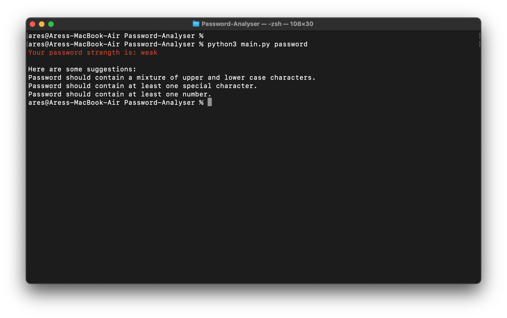
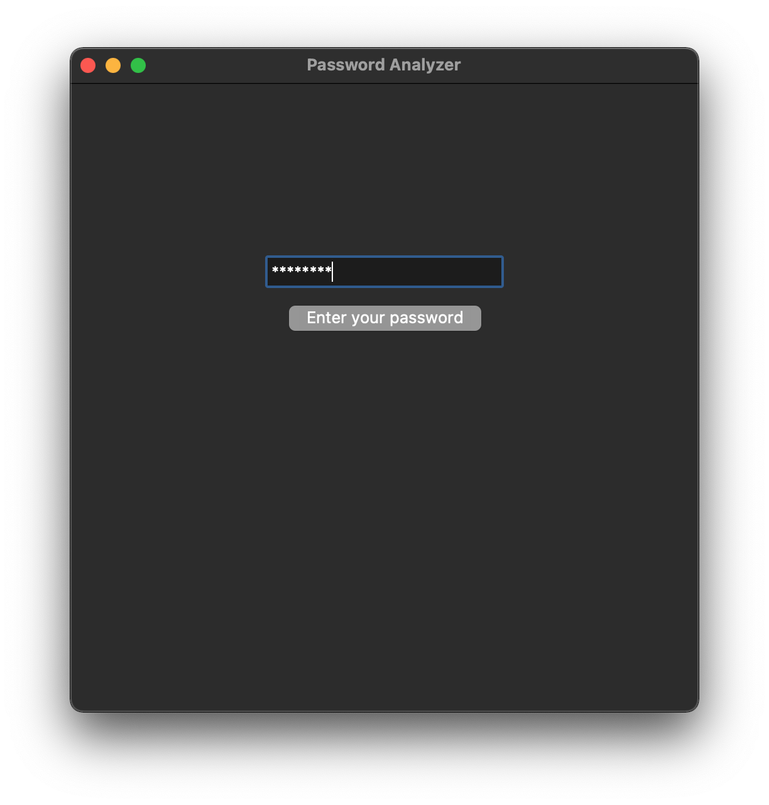
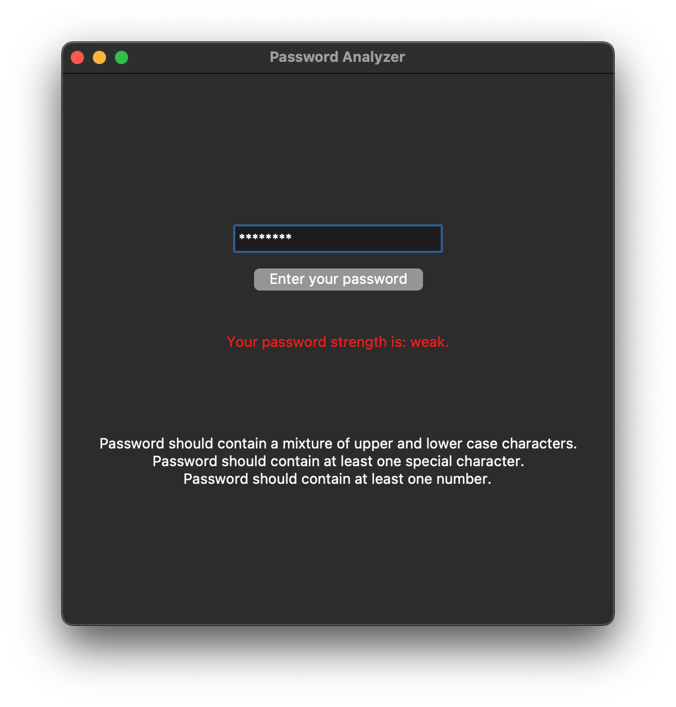

# Password-Analyser
A simple program to analyse the strength of a given password.

### How to run

This program can be run in either GUI or CLI.

#### GUI

Make sure you have Tkinter installed or install using:

```sh
pip install tk
```

Run the app using:
```sh
python3 main.py
```

#### CLI

```sh
python3 main.py [YOUR_PASSWORD]
```

<details>
   <summary>Usage Examples</summary>
    
   ### CLI Example
  
   
   
   ### GUI Example
   
   
   
   
  

</details>
